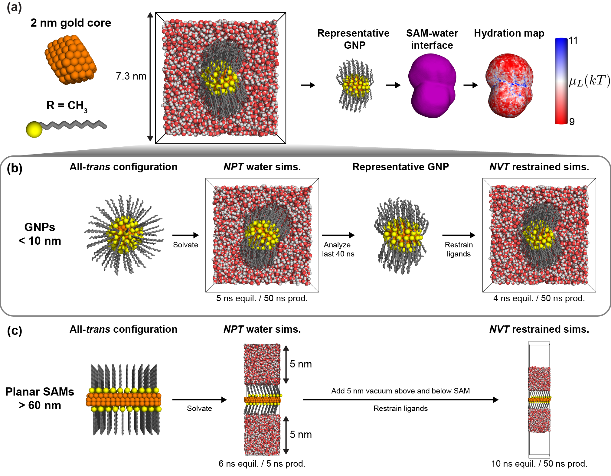

# interplay2020acsnano
This project contains codes required to reproduce the publication:  
A. K. Chew, B. C. Dallin, and R. C. Van Lehn. “Interplay of Ligand Properties and Core Size Dictate the Hydrophobicity 
of Monolayer-Protected Gold Nanoparticles.” *ACS Nano*. **2021**, *15*, 3, 4534–4545. 
[Link](https://doi.org/10.1021/acsnano.0c08623)

# Overview

In this work, we quantified the hydrophobicity of monolayer-protected gold nanoparticles (GNPs) using atomistic 
molecular dynamics (MD) simulations. First, classical MD simulations were used to model GNPs in solution. Then, we 
compute the local hydration free energies at the nanoparticle-water interface by analyzing the interfacial fluctuations 
of water. These computational tools allow us to analyze interfacial hydrophobicity on non-planar geometries, which can 
yield insights into how GNPs may interact with other biomolecules. 


**Figure 1**. 
**(a)**  Schematic snapshot showing the workflow of estimating the hydrophobicity of monolayer-coated GNPs.
After MD simulations were performed, a representative GNP was identified as described in the Supporting Information. 
Then, the self-assembled monolayer (SAM) interface was defined and hydration maps were computed. 
MD simulation workflow for analyzing **(b)** small GNPs (<10 nm in diameter) and **(c)** planar SAMs (approximations of > 60 nm in diameter). 
For both workflows, a 50 ns *NVT* restrained production simulation was performed to quantify water density 
fluctuations at the SAM-water interface and compute hydration maps.

# Software

## Installation
To download all codes:
```buildoutcfg
# Clone the repository.
git clone git@github.com:alexkchew/interplay2020acsnano.git
# Going into directory.
cd interplay2020acsnano
# Add any submodules crucial to this repository.
git submodule update --init
# Pulling submodules
git pull
```

## Installing Python environment
To access the same Python environment, install a conda environment using the Anaconda suite. 

### Creating environment using pre-installed .yml file
```

```

### Creating environment from scratch
```buildoutcfg
# Create the conda environment.
conda create -n interplay2020acsnano python=3.6.8
# Activating new conda environment.
conda activate interplay2020acsnano
# Installing modules
pip install numpy matplotlib scipy pandas scikit-image sklearn
# Installing MDTraj
conda install -n interplay2020acsnano cython
conda install -n interplay2020acsnano mdtraj
# If the above command does not work:
# Try: conda install -n interplay2020acsnano mdtraj -c conda-forge
# Installing Spyder
conda install -n interplay2020acsnano spyder==3.3.1
# Activate Spyder IDE by:
spyder --new-instance
# If this throws an error, try fixing with an install for the Python App
# conda install -f python.app
# Then, the yml file is created by: 
# conda env export --name interplay2020acsnano > interplay2020acsnano.yml
```


# Zenodo repository

All simulations and large data is stored within the Zenodo repository linked below:
[Zenodo Link]()

To install, download the repository from the link and decompress using the command below:
```buildoutcfg
# Command to decompress *.tar.gz files
tar -xvf interplay2020acsnano_zenodo.tar.gz
```

# Step-by-step


This is in a work of progress - still updating this page! Estimated time of completion: December 2021

